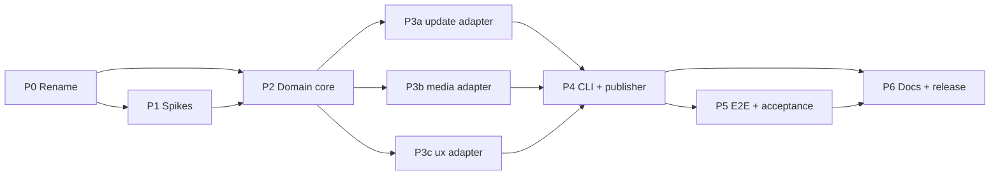

# incusos-builder Implementation Plan

A phased plan from the current `meigma/template-go` clone to shippable v1 of `incusos-builder`. Authoritative design: `.wt/journal-jmgilman/.journal/001/ARCHITECTURE.md` (§ references below are into that doc). Rules cited by ID are from `AGENTS.md`. Per the repo owner's agile preference, the two genuinely risky mechanics — **seed splice + boot** and **pure-Go rescue media** — are prototyped in Phase 1, before any dependent build-out; later phases refine from working behavior rather than speculation.

**Phase order and dependency graph**

Global invariants every phase must respect (from ARCHITECTURE.md; do not re-litigate):

- Splice offset **2,148,532,224** bytes; seed partition is 100 MiB `seed-data`, but the build verifies both from the *acquired image's* GPT, never from constants alone (§7 invariant).
- Seed tar: uncompressed tar, entries mode 0600, YAML via `go.yaml.in/yaml/v4` with `WithV2Defaults()` — byte-compatible with upstream `writeSeed`; plus `kernel`/`security` entries the web service cannot emit.
- Upstream seed types are **imported**, not mirrored (`github.com/lxc/incus-os/incus-osd/api/seed`), pinned; a `go list -deps` gate asserts only type packages compile in.
- `security.encryption_recovery_keys` non-empty → `ErrConfig` (exit 3) with the upstream rationale; osd fatally rejects it at boot.
- Exit taxonomy: 0 ok · 1 internal · 2 usage · 3 `ErrConfig` · 4 `ErrDecrypt` · 5 `ErrFetch`/`ErrVersionNotFound` · 6 `ErrOutput`. Sentinels live where §6's error-ownership table says; `internal/cli` maps and nothing else.
- Untrusted index metadata: charset allowlist `[A-Za-z0-9._-]` (per segment), `url.JoinPath` only, 64 MiB index cap, `0 < Size ≤ 8 GiB`, exact byte count + sha256 on admission.
- Publication: unique dot-prefixed temps → fsync → hash → claim (`O_CREAT|O_EXCL`) → rename; resources first, image last; `--force` uses `.incusos-builder.bak` move-aside with reverse-order restore.
- `update.sjson` is the only document recovery trusts; rescue media without it is refused; both metadata bytes are carried **verbatim**.

---

## Phase 0 — Template rename pass · **S**

Makes the repo *be* `incusos-builder` before any feature work, so every later commit lands under the real module path. Follows `DELETE_ME.md`'s checklist, adapted.

| # | Step | Files | Notes |
|---|---|---|---|
| 0.1 | Rename module | `go.mod` | `go mod edit -module github.com/componere/incusos-builder`; fix imports in `cmd/`, `internal/` |
| 0.2 | Rename binary dir | `cmd/template-go` → `cmd/incusos-builder` | keep `main.go` wiring-only shape |
| 0.3 | Placeholder sweep | everything `rg "template-go|TEMPLATE_GO|github.com/meigma/template-go"` finds | `moon.yml` (project title/desc/owner `componere`, build task output `bin/incusos-builder`, build path), `.goreleaser.yaml` (`project_name`, build id/main/binary, archive name), `ghd.toml` (package, signer workflow, asset patterns, binary path), `melange.yaml` (package name, go/build binary path), `apko.yaml` (entrypoint, labels), `.github/workflows/release.yml` (`IMAGE_NAME`, validation names, summaries), `release-dry-run.yml`, `security-scan.yml` (local image name, scan category), `release-please-config.json`, `mise.toml` `[tasks.image-local]` (image tag `incusos-builder:dev`), `docs/mkdocs.yml` (site name + Pages URL `https://componere.github.io/incusos-builder/`), `README.md` (minimal honest stub for now — full rewrite is Phase 6), `CONTRIBUTING.md`/`SECURITY.md` review |
| 0.4 | Env prefix | `internal/cli` | Viper env prefix → `INCUSOS_BUILDER` (the template's `TEMPLATE_GO`) |
| 0.5 | Drop template demo bits | `internal/templateinfo/`, `internal/config/config.go` (template's) | delete `templateinfo`; the template's `internal/config` is unrelated to our config package — delete or gut it now so Phase 2 starts clean (no second convention) |
| 0.6 | Tooling for later phases | `mise.toml`, `mise.lock` | add `mockery` (aqua-backed, pinned) now so T2 is ready when ports exist; `mise lock` for all four platforms |
| 0.7 | `go mod tidy`; delete `DELETE_ME.md` | | |

**Deps**: none. **Parallel**: single PR, done as one pass — splitting invites half-renamed states.
**Gate**: `moon run root:check` green; `rg "template-go|TEMPLATE_GO|meigma/template-go"` returns nothing (excluding `reference/`, `.wt/`, `scaffold/`); `bin/incusos-builder --version` prints.
**Risks**: workflow/status-check name drift breaking branch protection → check `.github/repository-settings.toml` required-check names in the same pass; run the release **dry-run** workflow once after merge to prove the renamed pipeline before any real release.

---

## Phase 1 — De-risking spikes · **M**

Throwaway code (scratch `cmd/spike-*` mains or a spike branch), explicitly *not* production structure — no ports, no polish, no tests. Each spike ends with a short written finding appended to the journal (or a `docs/notes/` scratch file) that later phases consume. Order matches §10 priority. Findings feed Phase 2/3; nothing in Phase 2+ starts on a question a spike is scheduled to answer.

### 1.A Seed splice + first boot (the gate for everything)

1. Fetch the live `index.json` from `https://images.linuxcontainers.org/os` by hand/curl; pick the smallest current `image-iso` (or `image-raw`) for the dev arch.
2. Minimal Go scratch: gunzip via `klauspost/pgzip`, read the decompressed head, parse GPT (evaluate `go-diskfs`'s GPT reader vs. a ~200-line hand parse of header + 128 entries — decide which Phase 2 will use), assert `seed-data` partition starts at 2,148,532,224.
3. Render a minimal seed tar (`install` + `network`) with `go.yaml.in/yaml/v4` `WithV2Defaults()`; splice: copy offset bytes → tar → skip `len(tar)` → remainder.
4. Verify locally: `dd`-extract the region at the offset, untar, diff YAML against input. This part is fully automatable and becomes the T3 harness later.
5. **Boot** the spliced image in an Incus VM; confirm `incus-osd` consumes the seed (install target + network applied). Record how (host, commands, wall-clock time) — this doubles as spike 1.E data.

**Answers**: splice arithmetic is right end-to-end; GPT probe approach; yaml/v4 output is accepted by osd's strict decode; kernel/security entry filenames (verify against `reference/incus-os/incus-osd/internal/seed/seed.go` reader conventions) — inject one and confirm osd reads it.

### 1.B Pure-Go rescue media + recovery boot (open question §10.1)

1. Scratch: build a small `RESCUE_DATA` iso9660 (Rock Ridge + Joliet, volume label) and a GPT+FAT32 raw (partition named/labeled `RESCUE_DATA`, FAT at 1 MiB offset) with `github.com/diskfs/go-diskfs`, staging a fake `update/` tree.
2. Loop-mount/read-back check, then boot the recovery path with the media attached: recovery must detect the label and read `update/update.sjson`.
3. **Decision recorded**: go-diskfs suffices for both formats, or invoke the documented fallback (FAT32 raw only + `mkisofs` passthrough) — this reshapes `internal/media`'s scope in Phase 3b, so it must be settled first.

### 1.C Live server layout + metadata sizes (§10.2, §10.4)

Against the real server: confirm asset URL shape `serverURL/<version>/<filename>`; confirm `/<version>/update.json` and `/<version>/update.sjson` exist where the mirror layout implies; check whether any live `UpdateFull.URL` per-update override appears; parse the live sjson as `multipart/signed` and run the planned structural validation against it; **measure both metadata documents** and fix the size cap (expected ≪ 1 MiB; keep 8 MiB default if unmeasurable).

### 1.D Upstream type import feasibility

`go get github.com/lxc/incus-os/incus-osd@<pin>` in a scratch module; import `api/seed`, `api/images`, `api/customizer`; run `go list -deps` and record the compiled-in closure — confirm it is type-only (no `internal/`, no daemon packages) and note the transitive modules (`lxc/incus/v7 shared/api`, operations-center, migration-manager). Pick the pin (commit or tag) Phase 2 will use; this is the version `--version` reports.

### 1.E First-boot loop timing (§10.5)

From 1.A/1.B timings: decide whether the boot acceptance gate is CI-automatable (Incus VM on a Linux runner / self-hosted) or a documented release-checklist item. Record the decision; Phase 5 implements it.

**Deps**: Phase 0 (nice-to-have, not blocking — spikes can run on the unrenamed tree in a worktree). **Parallel**: 1.A and 1.B are independent; 1.C and 1.D are quick and can interleave. **Size**: M overall; 1.A is the long pole (VM boot).
**Gate**: journal entry per spike with the concrete answers above; spike code deleted or clearly quarantined (never merged into `internal/`).
**Risks**: *(1.A)* offset/GPT assumption wrong for the current release → this is exactly why the spike exists; if drift is found, ARCHITECTURE §7's probe-first design already covers it — record actual offsets. *(1.B)* go-diskfs ISO output unbootable/unmountable → fallback path is pre-approved in §10.1. *(1.D)* upstream module graph forces non-type packages in → escalate before Phase 2; the mirror-types alternative was rejected for drift reasons, so this would be an architecture-level decision.

---

## Phase 2 — Domain core: config, seed, build · **L**

Production code begins. Everything here is pure or port-mediated (A1); no network, no adapter yet. Add deps: pinned `github.com/lxc/incus-os/incus-osd` (from 1.D), `go.yaml.in/yaml/v4`, `github.com/getsops/sops/v3`, `klauspost/pgzip`, GPT reader per 1.A's decision.

### 2.1 `internal/build` — types, ports, sentinels *(first: everything depends on the port shapes)*

- Files: `doc.go`, `spec.go` (`Spec`, domain types per I1 — `ImageType`, `Architecture`, `Channel`, `Release`…), `ports.go` (`ImageSource`, `VerifiedAsset`, `ReleaseMetadata`, `Reporter`, `RescueWriter`, `RescueInput`, `RescueAsset` — copy the §6 contracts verbatim, incl. the Open-twice/handle-lifetime doc comments), `errors.go` (`ErrOutput`, `ErrVersionNotFound`), `resolve.go` (`Resolve`: channel membership, exact `release` pin or highest version, exactly-one-image, application `<name>.raw.gz` matching), `plan.go` (`Plan`, `Result`).
- `.mockery.yml` at repo root configured for the three ports → `internal/update/mocks`, `internal/media/mocks`, `internal/ux/mocks` (T2/T3); wire `mockery` generation as a moon task (or `go:generate`) so regeneration is one command.
- Tests (T1): `Resolve` tables against synthetic indexes — channel filtering, pinning, highest-version, exactly-one-image violation, application-asset matching incl. the exit-5 "applications the update does carry" message.

### 2.2 `internal/seed` — pure renderer

- Files: `doc.go`, `seed.go` (`Render(Seeds) (tar []byte, size int64, err)`).
- Nine upstream entry names + `kernel`/`security` entries using osd-reader filename conventions confirmed in 1.A; mode 0600; yaml/v4 `WithV2Defaults()`.
- Tests (T1): **golden nine-section tar** byte-identical to upstream `writeSeed` output (generate the golden once from a fully-populated `ImagesPostSeeds`); separate goldens for `kernel`/`security` verified by strict-decode round-trip into `apiseed` types. This golden is the upstream-drift alarm (§4).

### 2.3 `internal/config` — load → SOPS → decode → validate → `build.Spec`

- Files: `doc.go`, `load.go` (file/stdin read, top-level-`sops`-key probe, `decrypt.Data(raw, "yaml")`, in-memory only), `schema.go` (`version: 1`, `image:`, `seeds:` embedding the imported upstream types), `validate.go`, `errors.go` (`ErrConfig`, `ErrDecrypt`).
- Validation per §4: strict decode (unknown fields → exit 3 with the "unknown to incus-os <pin>" wording), enums, `offline ⇒ update.check_frequency: never` (create seed if absent), `offline ⇒ applications non-empty`, **recovery-keys rejection**, install `sort_order` enum. Error messages reference field paths, never values (secrets).
- Tests (T1): validation tables; SOPS probe matrix incl. `sops`-present-but-malformed → `ErrDecrypt` (never falls through to decode errors), no-key, MAC-mismatch (fixtures encrypted with a checked-in throwaway age key), encrypted-stdin.

### 2.4 `internal/build` — probe + splice orchestration

- Files: `probe.go` (open handle → pgzip head → GPT → assert `seed-data` at 2,148,532,224 as `ErrFetch`; tar-fits-partition as `ErrConfig` with actual-vs-capacity), `build.go` (`Build(ctx, spec, src, rescue, reporter, out, resourcesTmp)`: Index → Resolve → Asset → probe → Render → splice → offline lane). Splice loop with a single reused buffer, explicit read/write error attribution (read side wraps as-is, write side `ErrOutput`) — no bare `io.Copy` across the ports (§6, P2).
- Offline lane: app `Asset` handles ×N, `ReleaseMetadata(version, selected)`, `RescueWriter.WriteRescue` with the typed `RescueInput`.
- Tests (T2): `Build` with mockery `ImageSource`/`RescueWriter`/`Reporter` over a small synthetic gzip image with a real GPT (build the fixture with the 1.A GPT code): bytes-before/tar/bytes-after assertions; **image handle opened exactly twice, each rescue handle once**; offline run asserts the exact `RescueInput` incl. both metadata docs matching the resolved version; oversized-tar → `ErrConfig`; shifted-partition fixture → `ErrFetch`.

**Deps**: Phase 1 findings (GPT approach, seed filenames, upstream pin). Step order: 2.1 → {2.2, 2.3, 2.4} (2.2 and 2.3 fully parallel; 2.4 needs 2.1+2.2). **Parallel**: two agents can split {2.2+2.3} vs {2.1+2.4}.
**Gate**: `moon run root:check` green; `go test ./internal/...` covers the tables above; the `go list -deps` type-only gate exists as a CI-runnable check (script under `.github/scripts/` or a moon task asserting the upstream closure contains no `internal/`/daemon packages) and passes.
**Risks**: golden-tar fidelity (yaml/v4 option drift) → golden generated from a vendored copy of upstream's exact serialization call, asserted byte-for-byte; sops/v3 dependency weight (L1) → accepted per §5, isolated in `internal/config`; upstream strict-decode asymmetry (our decoder must reject exactly what osd rejects) → covered by round-trip tests into `apiseed` types.

---

## Phase 3 — Adapters · **L** (three independent tracks)

All three implement Phase-2 ports; each is one-purpose (A2), has `doc.go` (D4), and generated mocks already exist from 2.1. They can be built **in parallel by separate agents** once 2.1's port file is frozen.

### 3a `internal/update` — ImageSource (HTTPS + local dir) · M/L

- Files: `doc.go`, `errors.go` (`ErrFetch`), `validate.go` (charset allowlist, per-segment filename rules, sha256 hex check, Size range — all *before* any URL/path use), `client.go` (HTTPS source: `/index.json` via `io.LimitReader` 64 MiB, https-only enforcement, retry-on-5xx with backoff per E3, `url.JoinPath` everywhere), `cache.go` (content-addressed `<cache>/sha256/<digest>`; temp-in-cache-root admission requiring exact Size + digest; reuse re-hash + size check; `VerifiedAsset` handle over the immutable entry), `local.go` (directory source, same allowlist gating `<dir>/<version>/<filename>`), `metadata.go` (`ReleaseMetadata`: size-capped reads at the 1.C number, sjson `multipart/signed` payload → `apiimages.Update` with version + selected filename/sha256 coverage, json twin version check, bytes verbatim), preflight statfs free-space *warning* (never an error from unsigned metadata).
- Progress: adapter reports through the injected `Reporter` (constructed with it) — progress originates at the network I/O.
- Contract tests (T2, `httptest`): everything §9's table lists — allowlist rejections (`?`/`#`/`%`/traversal shapes) as `ErrFetch` *before any request*; admission (short stream / trailing bytes / hash mismatch rejected identically); cache (rename only on full match, concurrent admission, reuse re-check); handle contract (Open twice = identical bytes, Size matches); ReleaseMetadata (both files from `/<version>/`, cap enforcement, structural failures); https-only; retry-on-5xx; local-dir parity.

### 3b `internal/media` — RescueWriter (go-diskfs) · M

- Files: `doc.go`, `rescue.go` (+ `iso.go`/`fat.go` if R2 pressure) — per 1.B's decision. Writes into caller-owned `tmpPath`; never chooses paths; streams from `VerifiedAsset` handles; refuses empty `UpdateSJSON`; `RelPath` gated by the shared allowlist rules; all failures wrapped `build.ErrOutput`.
- iso9660: label `RESCUE_DATA`, Rock Ridge + Joliet. Raw: GPT, one `RESCUE_DATA` partition, FAT32 at 1 MiB offset — parameters proven in 1.B.
- Contract tests (T2): write media from fake handles into a temp, read back with go-diskfs: label, fs type, `update/` tree, **metadata bytes verbatim**; empty-sjson refusal.

### 3c `internal/ux` — Reporter (Lip Gloss/Log) · S/M

- Files: `doc.go`, `palette.go` (one shared Lip Gloss palette per the charmbracelet skill's integration map), `reporter.go` (`ux.New(colorMode, progressMode, stderr)` → fancy or plain `Reporter`), `fancy.go` (styled step headers, single-line progress redraw on stderr, summary block, `versions` table renderer), `plain.go`.
- `charm.land/log/v2` as the only logger (stderr, `--verbose`/`-q` levels, styling follows `--color`).
- Tests: renderers against capture buffers — plain output shape; color/progress mode matrix (`NO_COLOR`, `TERM=dumb`, non-TTY).

**Deps**: 2.1 (ports). 3a additionally benefits from 1.C (cap, live layout); 3b requires 1.B's decision. **Parallel**: fully.
**Gate**: per-adapter contract test suites green under `moon run root:check`; mocks regenerate cleanly (`mockery` task produces no diff).
**Risks**: *(3a)* live-server quirks not seen in 1.C (e.g. `UpdateFull.URL` overrides appearing later) → local-dir source + httptest keep development unblocked; T3 in Phase 5 is the live safety net. *(3b)* go-diskfs API friction on FAT-at-offset → 1.B has already proven the exact call sequence; worst case the pre-approved fallback narrows scope. *(3c)* charm v2 API drift vs. the skill's validated surface → pin versions, keep the fancy renderer thin.

---

## Phase 4 — CLI surface + output publisher · **M/L**

Rewrites `internal/cli` from the template skeleton into the §3 surface. This is the integration point: wiring in `cmd/incusos-builder/main.go` stays construction-only.

| # | Step | Files | Content |
|---|---|---|---|
| 4.1 | Publisher first (it gates everything `build` does) | `internal/cli/publish.go` | path validation (resources default `<stem>.resources.<ext>`, distinct, never `-`, violations exit 2); pre-work existence check (UX only); unique temps via `os.CreateTemp(dir, ".<base>-*.tmp")`; hashing writer on the image temp, re-read hash for resources; claim-then-rename no-clobber; `--force` bak/restore ordering exactly per §3 (image aside first, restore image last); cleanup on handled failure; failures wrapped `build.ErrOutput` |
| 4.2 | Root + policy | `root.go`, `policy.go` | global flags `--color/--progress/--no-input/--verbose/-q`; TTY detection; `--no-input` auto-on (non-TTY stdin/stdout or `CI`); Viper precedence flags > `INCUSOS_BUILDER_*` > defaults for `--server/--cache-dir/--json/--color/--progress/--no-input`; sentinel→exit-code mapping in one place; `--version` prints BuildInfo **plus the pinned incus-os API version** |
| 4.3 | `build` | `build.go` | `-f`/`-o`/`--resources-output`/`--force`/`--server`/`--cache-dir`/`--json`; usage-error matrix (`--json` with `-o -`; `offline` with `-o -`); `-o -` streams artifact bytes on stdout with summary suppressed; `.gz` output recompression via pgzip; overwrite confirm via Huh when input allowed; JSON envelope (success/error shapes per §3, digests from the publisher) |
| 4.4 | `validate`, `versions` | `validate.go`, `versions.go` | same envelope shape; `versions` renders the ux table or JSON; `--channel/--architecture/--server` |
| 4.5 | `init` | `init.go` | Huh form when interactive (`ACCESSIBLE` honored); deterministic commented example config under `--no-input` — the example is generated from the schema so it can't drift |
| 4.6 | Wiring | `cmd/incusos-builder/main.go` | construct config loader, update source (HTTPS vs local dir by `--server` shape; https-only), media writer, `ux.New` reporter (plain + summary-suppressed under `--json`/`-o -`), publisher; inject into `build.Build` |
| 4.7 | Tests | `internal/cli/*_test.go`, `testdata/*.txtar` | publisher unit tests (distinct-path rejection, claim races via a file appearing post-check, force rollback ordering, concurrent non-force builds); `testscript` (go-internal, already an indirect dep) e2e over the CLI with a **local-dir source fixture** (tiny synthetic image + index from Phase 2 fixtures): exit codes 2/3/4/5/6 each provoked, `--json` envelope golden, `-o -` byte-exactness, no-input/no-TTY behavior, stdin config incl. SOPS |

**Deps**: Phases 2 + 3 complete (3c can lag slightly; plain reporter suffices for early wiring). **Parallel**: 4.1 and 4.2 first and in parallel; 4.3–4.5 after both; 4.7 grows alongside.
**Gate**: `moon run root:check` green; testscript suite proves the full matrix above against the local-dir fixture — a seeded image builds end-to-end offline-from-network on a dev machine; manually: `incusos-builder build -f example.yaml -o out.iso` against the live server produces a bootable artifact (spot-check with the 1.A harness).
**Risks**: publisher edge cases (crash-window semantics) → keep to §3's spelled-out ordering, test the handled-failure paths, document the `.bak` recovery; interaction-policy regressions (a prompt sneaking into CI) → testscript runs with no TTY by construction, so any hang fails the suite; stdout purity under `--json` → envelope tests assert stdout is exactly one JSON document.

---

## Phase 5 — E2E + boot acceptance · **M**

### 5.1 T3 live suite (env-gated `INCUSOS_BUILDER_E2E=1`)

- `e2e_test.go` (top-level or `internal/cli`): `versions` parses the live index; full `build` of the smallest image; harness dd-extracts the region at 2,148,532,224, untars, diffs each YAML section against the spec (promote the 1.A verifier); offline build's media read back (go-diskfs cross-platform; loop-mount variant on Linux CI) for label, fs, file set incl. both metadata files.
- Wire as an opt-in moon task (`root:e2e`) excluded from `root:check`; optionally a scheduled CI job.

### 5.2 Boot acceptance gate

- Per 1.E's decision: **automatable** → CI job (Linux runner or self-hosted with Incus) that boots the built ISO in an Incus VM, waits for `incus-osd` to apply the seed (install target + network observable), then boots recovery with rescue media attached and asserts `RESCUE_DATA` detection + signed-metadata acceptance. **Not CI-viable** → a written release checklist in `docs/` (how-to) with the exact Incus commands from 1.A/1.B, executed before each release tag.
- What is automatable **locally without a VM**, stated for the record: splice-region diff, seed-tar round-trip, rescue-media read-back, all exit-code/JSON behavior, live-index parsing. What **needs a VM**: osd seed consumption and recovery-path acceptance — the two boot checks above, nothing else.

**Deps**: Phase 4. **Parallel**: 5.1 and 5.2 independent.
**Gate**: T3 suite passes against the live server; one full boot acceptance run recorded (CI log or checklist run) for both online and offline artifacts.
**Risks**: live-server changes breaking T3 (env-gated, so not a merge blocker) → failures triage into "our bug" vs "upstream drift", the golden tar + type-pin gates localize the latter; VM flakiness in CI → time-box per 1.E; the checklist fallback is acceptable for v1.

---

## Phase 6 — Docs, release polish, v1 · **M**

### 6.1 Diátaxis docs (D5/D6) under `docs/docs/`

- **Tutorial**: first seeded ISO — install, write a minimal config, build, boot (mirrors 1.A).
- **How-to guides**: SOPS-encrypt a config (age walkthrough, `SOPS_AGE_KEY`); build offline media (two artifacts, rescue boot); run in CI/automation (`--json`, exit codes, `--no-input`, env vars); use a local mirror (`--server DIR`); recover from an interrupted `--force` build (`.bak` renames); the release boot checklist (if 5.2 chose checklist).
- **Reference**: full config schema (generated or hand-maintained against the pinned upstream types, incl. the kernel/security CLI extensions and the recovery-keys refusal), CLI flags per command, exit-code table, JSON envelope schema, `INCUSOS_BUILDER_*` env vars, cache layout & location.
- **Explanation**: trust model (HTTPS + sha256 + structural sjson checks; why not S/MIME in v1; boot as the trust boundary), seed injection mechanics (offset, partition invariant), upstream version coupling (what a pin bump means).
- `mkdocs.yml` nav restructured to the four Diátaxis sections; Plain Language style.

### 6.2 README + repo docs

Rewrite `README.md` (install via ghd/brew-less binary + container, quickstart, doc links); review `CONTRIBUTING.md`/`SECURITY.md`; add license if still missing.

### 6.3 Release verification

- Re-run the release **dry-run** workflow (binary + container) post-rename with the real binary; verify GoReleaser artifacts, melange/apko image entrypoint runs `incusos-builder --version`, ghd install path, attestations.
- Confirm Release Please config produces the changelog; cut `v0.x` pre-release, exercise the full pipeline, then v1 when the Phase-5 gate has passed on a release candidate.
- Park §10 follow-ups as issues: signed index `--update-ca`, update-tarball artifact, HTTP Range resume, cache eviction, pin-bump cadence.

**Deps**: Phase 4 (docs describe real behavior); Phase 5 for the boot checklist content and the v1 tag. **Parallel**: 6.1/6.2 can start during Phase 5.
**Gate**: `moon run root:check` (includes `docs:build`) green; Pages deploy renders; dry-run workflow green; tagged v1 release with binaries, image, SBOMs, attestations.
**Risks**: docs drifting from CLI behavior → D6 discipline from Phase 4 onward (each behavior PR touches docs); release-pipeline surprises → the Phase-0 and Phase-6 dry-runs bracket all changes.

---

## Cross-cutting execution notes

- **Hand-off unit**: one phase (or one Phase-3 track) per programmer-agent assignment; each carries its gate command. Phases 2–4 land as reviewable PR stacks; spikes never merge.
- **Rule compliance checkpoints** per PR: `doc.go` in every new package (D4), Godoc on every symbol incl. unexported (D1), no hand-written mocks (T2), file size < 1,000 lines (R2 — `internal/update` and `internal/cli` are the ones likely to need splitting), domain types over strings (I1), streaming over buffering on the multi-GB paths (P2).
- **Dependency additions**, all in Phase 2/3 as needed and pinned: `lxc/incus-os/incus-osd@<1.D pin>`, `go.yaml.in/yaml/v4`, `getsops/sops/v3`, `klauspost/pgzip`, `diskfs/go-diskfs`, `charm.land/{lipgloss,huh,log}/v2`, `stretchr/testify`, mockery (tool, via mise). Anything else needs an L1 argument in the PR.
- **Estimated critical path**: P0 → 1.A → 2.1 → 2.4 → 3a → 4.1/4.3 → 5. Phases 3b/3c, 2.2/2.3, and 6.1 hang off it in parallel.
